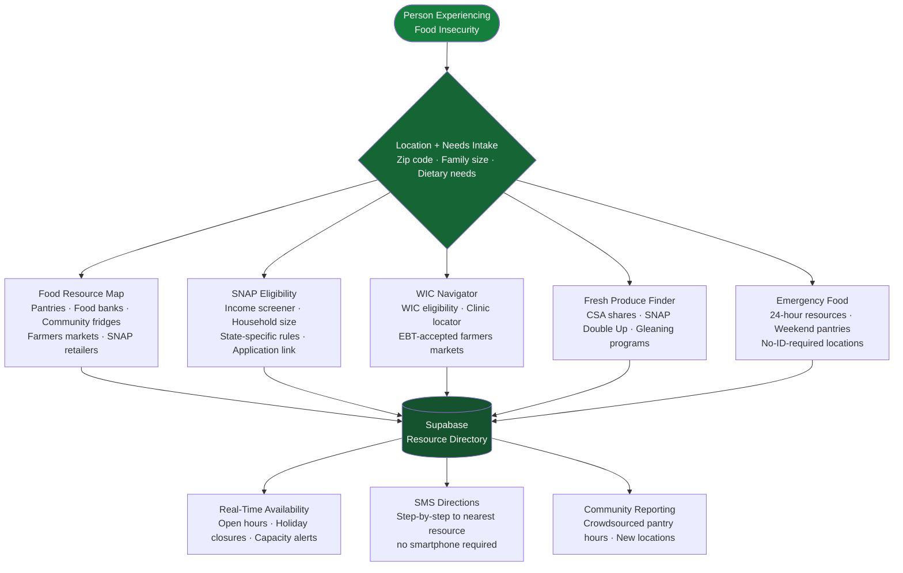

<p align="center">
  <h1 align="center">foundation-fresh-access</h1>
  <h3 align="center"><em>Food desert navigation — map every food resource, SNAP eligibility, fresh produce for 19 million Americans.</em></h3>
</p>

<p align="center">
  <a href="LICENSE"></a>
  
  
  <a href="https://mama.oliwoods.ai"></a>
  <a href="https://mama.oliwoods.ai/foundation"></a>
</p>

---

> *"19 million Americans live in food deserts — areas where the nearest grocery store is more than a mile away and car ownership rates are low. For them, 'eating healthy' isn't a choice, it's a geography problem."*
> — **USDA Economic Research Service, 2023** | 42 million Americans — 1 in 8 — experience food insecurity. Only 83% of eligible households are enrolled in SNAP.

---

## Why This Exists

Food insecurity is not a motivation problem. It's a logistics problem, a knowledge problem, and a systemic access problem. The resources exist — but they're invisible to the people who need them most.

- **19 million Americans** live in food deserts with no easy access to a grocery store — USDA ERS 2023
- **42 million people** — including 13 million children — experience food insecurity — Feeding America 2023
- **$9 billion in SNAP benefits** go unclaimed annually because eligible households don't know they qualify or can't complete enrollment — CBPP 2022
- Food insecurity is linked to **25% higher healthcare costs** per person due to diet-related chronic illness — JAMA Internal Medicine 2022
- **70% of food pantries** report serving first-time visitors who didn't previously know the pantry existed — Feeding America Network Survey 2022

**We built this because the food is often there. The map isn't.**

---

## System Architecture



---

## Features

| Feature | What It Does | Data Sources |
|---|---|---|
| **Food Resource Map** | Real-time map of food pantries, food banks, community fridges, farmers markets | Feeding America, WhyHunger, OpenStreetMap |
| **SNAP Eligibility Screener** | Estimates eligibility by household size and income, generates application link by state | USDA FNS, Benefits.gov |
| **WIC Navigator** | Screens for WIC eligibility, finds local WIC clinics, maps EBT-accepted farmers markets | USDA WIC, SNAP-Ed, Farmers Market Coalition |
| **Fresh Produce Finder** | CSA shares, SNAP Double Up Food Bucks, gleaning programs, produce rescue | Double Up Food Bucks, local gleaning networks |
| **Emergency Food** | 24-hour resources, weekend pantries, no-ID-required locations with current hours | 211.org, local food bank APIs |
| **SMS Directions** | Step-by-step directions to nearest resource via text — no app or smartphone required | Twilio, Google Maps API |
| **Community Reporting** | Crowdsourced pantry hours, new resource submissions, real-time capacity alerts | User contributions + staff verification |

### Platform Capabilities
- **Works on Any Phone** — SMS-only mode for flip phones and no-data plans
- **No ID Required Mode** — filters resources that don't require documentation
- **15+ Languages** — Spanish, French, Haitian Creole, Arabic, Somali, and more
- **Offline-First** — cached local directory for areas with poor connectivity
- **Privacy-First** — no income data stored; anonymous access available

---

## Quick Start

```bash
git clone https://github.com/OliWoods-Org/foundation-fresh-access.git
cd foundation-fresh-access
npm install
npm run dev
```

## Tech Stack

- **Runtime:** Node.js + TypeScript
- **Validation:** Zod schemas
- **Database:** Supabase (PostgreSQL)
- **AI:** Claude API / local LLM (eligibility explanation, resource matching)
- **Mapping:** Google Maps API, OpenStreetMap
- **Alerts:** Twilio (SMS), Resend (email)
- **Data:** USDA FNS, 211.org, Feeding America API

---

## Research & Citations

- USDA Economic Research Service. (2023). *Food Access Research Atlas*. ers.usda.gov/data-products/food-access-research-atlas
- Feeding America. (2023). *The State of Senior Hunger in America*. feedingamerica.org
- Center on Budget and Policy Priorities. (2022). *SNAP Participation Rates by State*.
- Feeding America. (2022). *Hunger in America Network Survey*.
- Berkowitz, S.A. et al. (2022). Food insecurity and health care expenditures. *JAMA Internal Medicine*.

---

## Contributing

We welcome contributions. This is open source because we believe in community-driven solutions.

1. Fork the repo
2. Create a feature branch (`git checkout -b feat/your-feature`)
3. Commit your changes
4. Push and open a PR

## License

AGPL-3.0 — Free to use, modify, and distribute.

---

<p align="center">
  <strong>Built by the <a href="https://oliwoods.ai">OliWoods Foundation</a></strong><br>
  <em>Free forever. Open source. Because fresh food is not a luxury — and the map should be free.</em>
</p>
